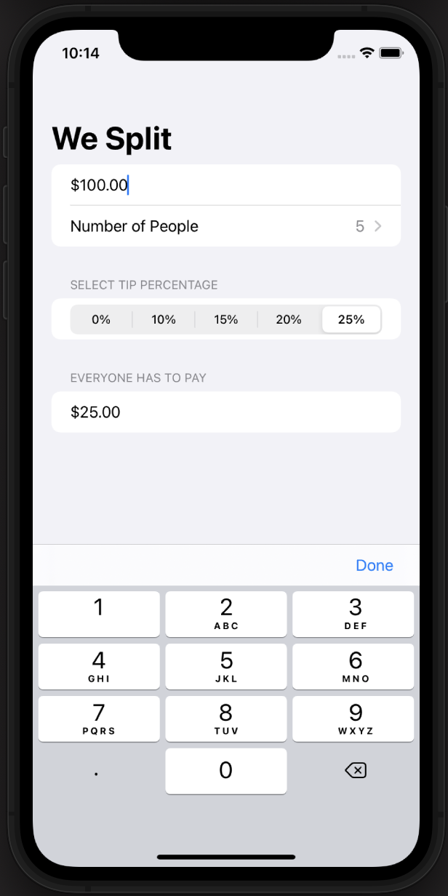

# WeSplit

Hi there!

Last week I decided to start a new course about SwiftUI called 100 days of SwiftUI, by Paul Hudson. The reason was that I wanted to check how much I had learned about Swift and SwiftUI during this time of self-learning and, at the same time, having the chance of adding new skills to my toolbelt.

The first real project that this course presents is a tip calculator. The app uses parameters such as the total amount, number of people and the tip percentage to return the amount that everyone will have to pay.

Despite this app is not complex, I have to say that I have learn to many things, so I will make a list of everything I learned coding it:

-	Format: views like Textfield and Text has an attribute called “format: “ that allows us to choose the type of content we want our views show. Among others, we can select percentages or currencies. So that, SwiftUI will automatically format our data without having to do it ourselves.

-	Locale: struct containing a lot of the device information. In this project we used to get the user default currency abbreviation. This parameter was used with format to set the currency. As this parameter is optional it was necessary take advantage of nil coalescing to provide a default value in case we got nil when accessing to this parameter.

-	@FocusState: wrapper that allows swift to detect that one variable will be used to control whether some view is focused or not when using “.focus: “. Whenever we change this view focus’ SwiftUI will update the value of this variable.

To finished, I also added something on my own: 

-	MVVM pattern: To decouple the view from the logic of the app, I decided to apply the MVVM pattern. This way, I create a new class called WeSplitModelView, which conforms the ObservableObject protocol in order to notify the views subscribed to it about any change.

-	Set the focus to the input TextField showing the Keyboard: using “.task{}” to run some operation on the background, I ordered SwiftUI to focused on this textField when showing the view.

###### Main Screen

